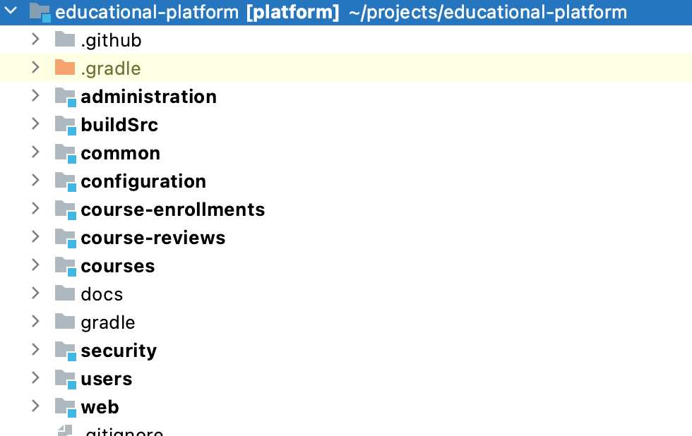
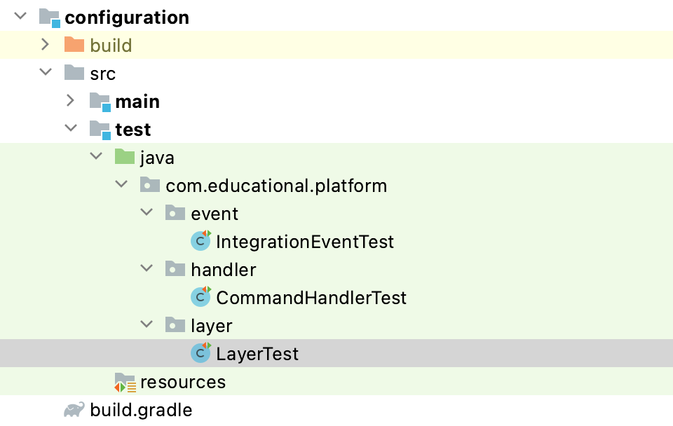
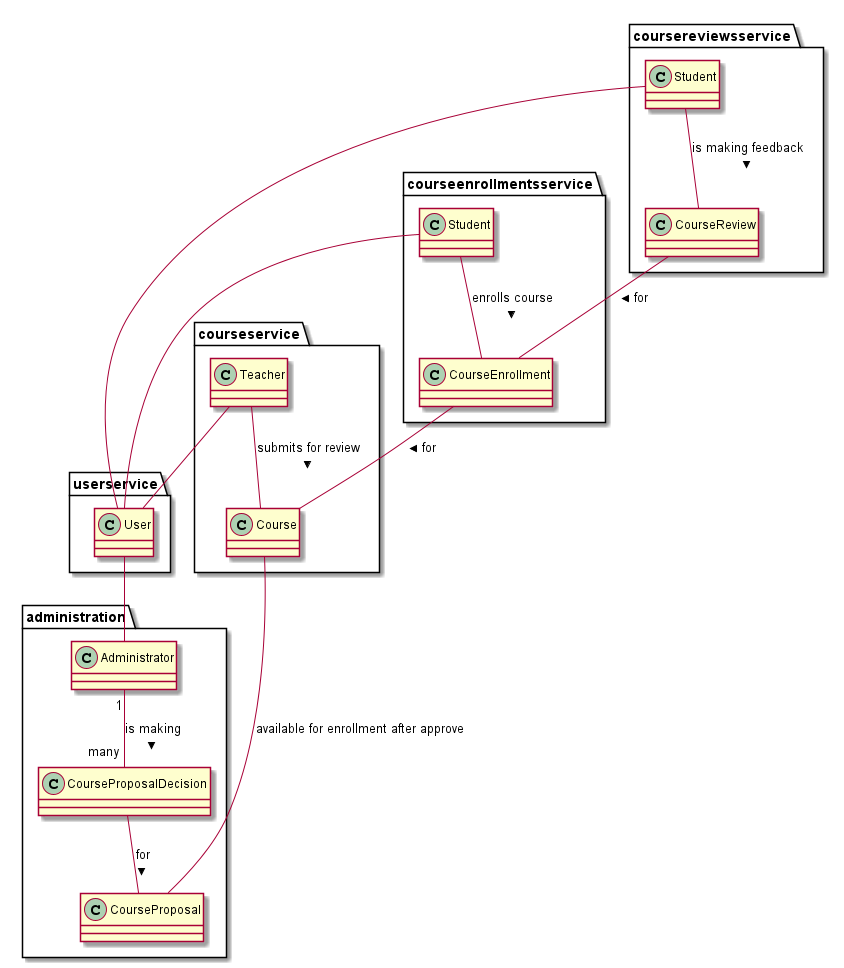

# Educational platform

Example of Modular Monolith Java application with DDD. In the plans, this application will be moved to microservices architecture.
- [1. The goals of this application](#1-the-goals-of-this-application)
- [2. Plan](#2-plan)
- [3. Architecture](#3-architecture)
    + [3.1. Module structure](#31-module-structure)
    + [3.2. Communications between bounded contexts](#32-communications-between-bounded-contexts)
    + [3.3. Validation](#33-validation)
    + [3.4. CQRS](#34-cqrs)
    + [3.5. The identifiers for communication between modules](#35-the-identifiers-for-communication-between-modules)
    + [3.6. API First](#36-api-first)
    + [3.7. Rich Domain Model](#37-rich-domain-model)
    + [3.8. Architecture Decisions](#38-architecture-decisions)
    + [3.9. Results from command handlers](#39-results-from-command-handlers)
    + [3.10. Architecture tests](#310-architecture-tests)
    + [3.11. Axon Framework](#311-axon-framework)
    + [3.12. Bounded context map](#312-bounded-context-map)
    + [3.13. Integration events inside application](#313-integration-events-inside-application)
    + [3.14. Technology stack](#314-technology-stack)
- [4. Contribution](#4-contribution)
- [5. Useful links](#5-useful-links)
- [6. License](#6-license)

## 1. The goals of this application
- the modular monolith with DDD implementation;
- correct separation of bounded contexts;
- example of communications between bounded contexts;
- example of simple CQRS implementation;
- documentation of architecture decisions;
- best practice/patterns using;

## 2. Plan
The issues are represented in https://github.com/anton-liauchuk/educational-platform/issues

High-level plan is represented in the table

| Feature | Status |
| ------- | ------ |
| Modular monolith with base functionality | COMPLETED |
| Microservices |  |
| UI application |  |

## 3. Architecture
### 3.1. Module structure


Modules which represent business logic:

**administration**

`Administrator` can approve or decline `CourseProposal`. After approving or declining the proposal, corresponding integration event is published to other modules.

**courses**

A `Teacher` can create new `Course`. This `Course` can be edited. A `Student` can view the list of `Course` and search by different parameters. The `Course` contains the list of `Lecture`. After getting the approval, `Course` can be published. Depends on other modules, number of students and course rating can be recalculated.

**course-enrollments**

A `Student` can enroll `Course`. A `Lecture` can be marked as completed. `Student` can view the list of `Course Enrollment`. `Course Enrollment` can be archived, completed. On new enrollment action, the number of students is recalculated and new number is published as integration event.

**course-reviews**

A `Student` can create/edit feedback to enrolled `Course`. The list of `Course Review` are used for calculating the rating of `Course` and `Teacher`. `Course Review` contains comment and rating.

**users**

A `User` can be created after registration. `User` has the list of `Permission`. `User` can edit info in profile. `User` has role `Student` after registration. `User` can become a `Teacher`. After registration, the integration event about new user is published to other modules.

Each business module has 3 sub-modules: 


**application**

Contains domain model, application service and other logic related to the main functionality of module.

**integration-events**

Integration events which can be published from this business module.

**web**

API implementation.

Modules with base technical functionality:

**common**

Contains common functionality which can be used in other modules.

**configuration**

Module contains start application logic for initializing application context, it's why this module has dependency to all other modules. Architecture tests are placed inside test folder.

**security**

Contains the logic related to security.

**web**

Definition of common formats for API.

### 3.2. Communications between bounded contexts
Communication between bounded contexts is asynchronous. Bounded contexts don't share data, it's forbidden to create a transaction which spans more than one bounded context.

This solution reduces coupling of bounded contexts through data replication across contexts which results to higher bounded contexts independence. Event publishing/subscribing is used from Axon Framework. The example of implementation:
```java
@RequiredArgsConstructor
@Component
public class ApproveCourseProposalCommandHandler {

    private final TransactionTemplate transactionTemplate;
    private final CourseProposalRepository repository;
    private final EventBus eventBus;

    /**
     * Handles approve course proposal command. Approves and save approved course proposal
     *
     * @param command command
     * @throws ResourceNotFoundException              if resource not found
     * @throws CourseProposalAlreadyApprovedException course proposal already approved
     */
    @CommandHandler
    @PreAuthorize("hasRole('ADMIN')")
    public void handle(ApproveCourseProposalCommand command) {
        final CourseProposal proposal = transactionTemplate.execute(transactionStatus -> {
            // the logic related to approving the proposal inside the transaction
        });

        final CourseProposalDTO dto = Objects.requireNonNull(proposal).toDTO();
        // publishing integration event outside the transaction
        eventBus.publish(GenericEventMessage.asEventMessage(new CourseApprovedByAdminIntegrationEvent(dto.getUuid())));
    }
}
```

The listener for this integration event:
```java
@Component
@RequiredArgsConstructor
public class SendCourseToApproveIntegrationEventHandler {

    private final CommandGateway commandGateway;

    @EventHandler
    public void handleSendCourseToApproveEvent(SendCourseToApproveIntegrationEvent event) {
        commandGateway.send(new CreateCourseProposalCommand(event.getCourseId()));
    }

}
```

### 3.3. Validation
Always valid approach is used. So domain model will be changed from one valid state to another valid state. Technically, validation rules are defined on `Command` models and executed during processing the command. Javax validation-api is used for defining the validation rules via annotations.

Example of validation rules for command:
```java
/**
 * Create course command.
 */
@Builder
@Data
@AllArgsConstructor
public class CreateCourseCommand {

    @NotBlank
    private final String name;

    @NotBlank
    private final String description;

}
```

Example of running validation rules inside the factory:
```java
/**
 * Represents Course Factory.
 */
@RequiredArgsConstructor
@Component
public class CourseFactory {

	private final Validator validator;
	private final CurrentUserAsTeacher currentUserAsTeacher;

	/**
	 * Creates course from command.
	 *
	 * @param courseCommand course command
	 * @return course
	 * @throws ConstraintViolationException in the case of validation issues
	 */
	public Course createFrom(CreateCourseCommand courseCommand) {
		final Set<ConstraintViolation<CreateCourseCommand>> violations = validator.validate(courseCommand);
		if (!violations.isEmpty()) {
			throw new ConstraintViolationException(violations);
		}

		var teacher = currentUserAsTeacher.userAsTeacher();
		return new Course(courseCommand, teacher.getId());
	}

}
```

Command handlers/factories contain complete rules of validation. Also, some format validation can be executed inside the controller. It's needed for fail-fast solution and for preparing the messages with context of http request.
Example of running format validation:

```java
/**
 * Represents Course API adapter.
 */
@Validated
@RequestMapping(value = "/courses")
@RestController
@RequiredArgsConstructor
public class CourseController {

    private final CommandGateway commandGateway;

    @PostMapping(consumes = APPLICATION_JSON_VALUE, produces = APPLICATION_JSON_VALUE)
    @ResponseStatus(HttpStatus.CREATED)
    CreatedCourseResponse create(@Valid @RequestBody CreateCourseRequest courseCreateRequest) {
        final CreateCourseCommand command = CreateCourseCommand.builder()
                .name(courseCreateRequest.getName())
                .description(courseCreateRequest.getDescription())
                .build();

        return new CreatedCourseResponse(commandGateway.sendAndWait(command));
    }
    
    //...
}
```

In Spring Framework this validation works by @Valid and @Validated annotations. As result, in the case of validation errors, we should handle MethodArgumentNotValidException exception. The logic related to handling this error represented inside GlobalExceptionHandler:
```java
@RestControllerAdvice
public class GlobalExceptionHandler {

	@ExceptionHandler(MethodArgumentNotValidException.class)
	public ResponseEntity<ErrorResponse> onMethodArgumentNotValidException(MethodArgumentNotValidException e) {
		var errors = e.getBindingResult()
				.getFieldErrors()
				.stream()
				.map(DefaultMessageSourceResolvable::getDefaultMessage)
				.collect(Collectors.toList());

		return ResponseEntity.status(HttpStatus.BAD_REQUEST).body(new ErrorResponse(errors));
	}
	//...
}

```

### 3.4. CQRS
CQRS principle is used. It gives the flexibility in optimizing model for read and write operations. The simple version of CQRS is implemented in this application. On write operations, full logic is executed via aggregate. On read operations, DTO objects are created via JPQL queries on repository level.
Example of command handler:
```java
@RequiredArgsConstructor
@Component
@Transactional
public class PublishCourseCommandHandler {

    private final CourseRepository repository;

    /**
     * Handles publish course command. Publishes and save published course
     *
     * @param command command
     * @throws ResourceNotFoundException        if resource not found
     * @throws CourseCannotBePublishedException if course is not approved
     */
    @CommandHandler
    @PreAuthorize("hasRole('TEACHER') and @courseTeacherChecker.hasAccess(authentication, #c.uuid)")
    public void handle(@P("c") PublishCourseCommand command) {
        final Optional<Course> dbResult = repository.findByUuid(command.getUuid());
        if (dbResult.isEmpty()) {
            throw new ResourceNotFoundException(String.format("Course with uuid: %s not found", command.getUuid()));
        }

        final Course course = dbResult.get();
        course.publish();
        repository.save(course);
    }
}
```

Example of query implementation with constructing DTO object inside Spring repository:
```java
/**
 * Represents course repository.
 */
public interface CourseRepository extends JpaRepository<Course, Integer> {

	/**
	 * Retrieves a course dto by its uuid.
	 *
	 * @param uuid must not be {@literal null}.
	 * @return the course dto with the given uuid or {@literal Optional#empty()} if none found.
	 * @throws IllegalArgumentException if {@literal uuid} is {@literal null}.
	 */
	@Query(value = "SELECT new com.educational.platform.courses.course.CourseDTO(c.uuid, c.name, c.description, c.numberOfStudents) "
			+ "FROM com.educational.platform.courses.course.Course c WHERE c.uuid = :uuid")
	Optional<CourseDTO> findDTOByUuid(@Param("uuid") UUID uuid);

	//...
}

```

### 3.5. The identifiers for communication between modules
Natural keys or uuids are used as identifiers. Primary keys are forbidden for communications between modules or with external systems. If entity has good natural key - it's the most preferable choice for identifier between modules.

### 3.6. API First
API First is one of engineering and architecture principles. In a nutshell API First requires two aspects:
- define APIs first, before coding its implementation, using a standard specification language;
- get early review feedback from peers and client developers;

By defining APIs outside the code, we want to facilitate early review feedback and also a development discipline that focus service interface design on:
- profound understanding of the domain and required functionality
- generalized business entities / resources, i.e. avoidance of use case specific APIs
- clear separation of WHAT vs. HOW concerns, i.e. abstraction from implementation aspects — APIs should be stable even if we replace complete service implementation including its underlying technology stack

### 3.7. Rich Domain Model
Rich domain model solution is used. Domain model encapsulates internal structure and logic.

### 3.8. Architecture Decisions
All decisions inside this project are placed inside [docs/architecture-decisions](docs/architecture-decisions).

### 3.9. Results from command handlers
The idea from CQRS - do not return anything from command processing. But in some cases, we need to get generated identifiers of new created resources. So as trade-off, command handlers can return generated identifiers after processing if it's needed.

### 3.10. Architecture tests
ArchUnit are used for implementing architecture tests. These tests are placed inside **configuration** module because this module has the dependencies to all other modules inside the application. It means that it's the best place for storing the tests which should validate full code base inside application.



**IntegrationEventTest** - tests for validating the format of integration events.

**CommandHandlerTest** - tests for validating the command handlers and related classes.

**LayerTest** - tests for validating the dependencies between layers of application.

### 3.11. Axon Framework
Axon Framework is used as DDD library for not creating custom building block classes. Also, more functionality for event publishing/event sourcing is used from Axon functionality.

### 3.12. Bounded context map


### 3.13. Integration events inside application


### 3.14. Technology stack
- Spring;
- Java 11;
- Lombok;
- Axon Framework;
- ArchUnit;
- Gradle;

## 4. Contribution
The application is in development status. Please feel free to submit pull request or create the issue.

## 5. Useful links
- [Modular monolith with DDD](https://github.com/kgrzybek/modular-monolith-with-ddd) - the most influenced project. This project was started as attempt of implementing something similar with Java stack.
- [Knowledge base](https://github.com/anton-liauchuk/java-interview) - The knowledge base about Java, DDD and other topics.

## 6. License
The project is under [MIT license](https://opensource.org/licenses/MIT).

