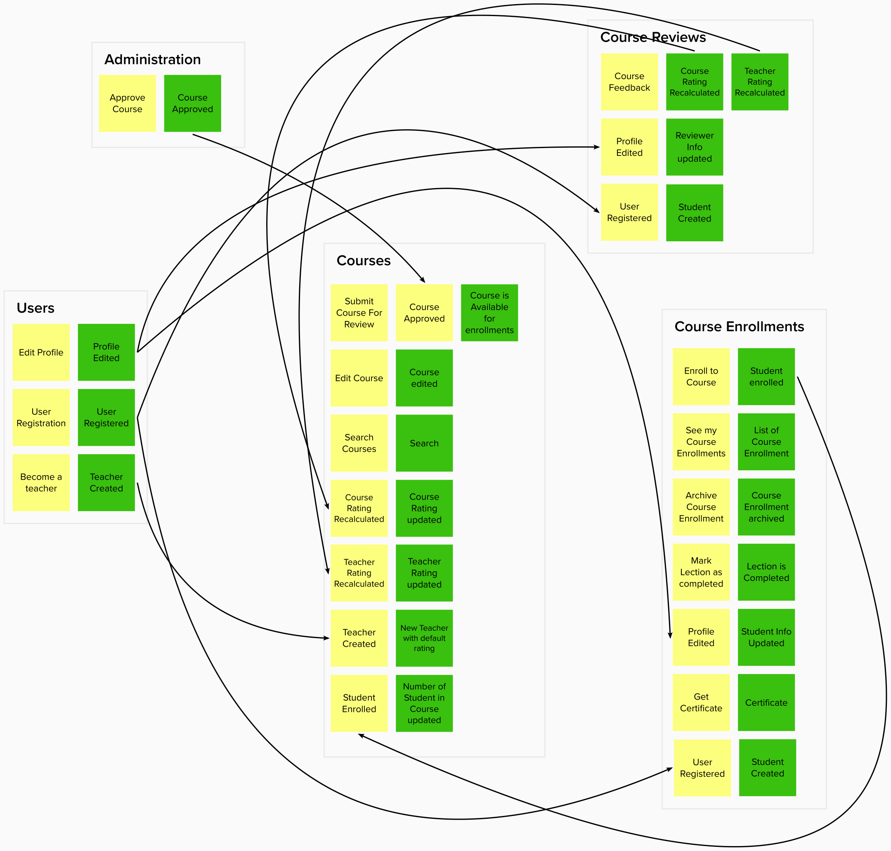

# Educational platform

Modular Monolith Java application with DDD.
- [1. Plan](#1-plan)
- [2. Architecture](#2-architecture)
- [3. Contribution](#3-contribution)
- [4. Useful links](#4-useful-links)

## 1. Plan
| Feature | Status |
| ------- | ------ |
| Modular monolith with base functionality |  |
| Authentication/Security rules in application |  |
| API |  |
| Architecture tests |  |
| Integration events as public sub-module for each module |  |
| Extend functionality in modules |  |
| UI application |  |
| Microservices |  |

## 2. Architecture
### 2.1. Modules
**Administration**
To create a new `Course`, a `Teacher` needs to get approve from `Administrator`. Accepted `Course` is available for enrollment.

**Courses**

A `Teacher` can submit for review new `Course`. This `Course` can be edited. A `Student` can view the list of `Course` and search by different parameters. The `Course` contains the list of `Lecture`.

**Course Enrollments**

A `Student` can enroll `Course`. A `Lecture` can be marked as completed. `Student` can view the list of `Course Enrollment`. `Course Enrollment` can be archived.

**Course Reviews**

A `Student` can create/edit feedback to enrolled `Course`. The list of `Course Review` are used for calculating the rating of `Course` and `Teacher`.

**Users**

A `User` can be created after registration. `User` has the list of `Permission`. `User` can edit info in profile. `User` has role `Student` after registration. `User` can become a `Teacher`.

### 2.2. Communications between bounded contexts
Communication between bounded contexts asynchronous. Bounded contexts don't share data, it's forbidden to create a transaction which spans more than one bounded context.

This solution reduces coupling of bounded contexts through data replication across contexts which results to higher bounded contexts independence.

### 2.3. Validation
Always valid approach is used. So domain model will be changed from one valid state to another valid state.

### 2.4. CQRS
CQRS solution is used. It will give us flexibility in optimizing model for read and write operations.

### 2.5. The identifiers for communication between modules.
Natural keys or uuids should be used. Primary keys are forbidden for communications between modules or with external systems.

### 2.6. Architecture Decisions

All decisions inside this project [docs/architecture-decisions](docs/architecture-decisions).

### 2.7. Bounded context map

### 2.8. Integration event inside application

## 3. Contribution
The application is in development status. Please feel free to submit pull request or create the issue.

## 4. Useful links
The knowledge base about Java, DDD and other topics - [https://github.com/anton-liauchuk/java-interview](https://github.com/anton-liauchuk/java-interview)

